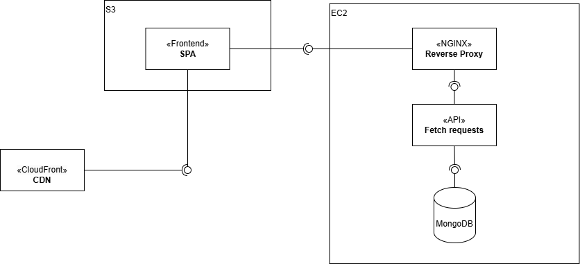

# Backend Documentation

This backend was made using docker in order to manage both the api running in Node
and the database concurrently. 


## The database
The DB was made in mongo (NoSQL) for storing URLs, it doesn't follow an strict schema but 
a general url has the following format:
```JSON
{ 
        longUrl: "www.longurldomain.com",
        shortUrl: "short_id",
        createdAt: date_of_creation,
        expiresAt: date_of_creation + 3 days,
        clicks: number_of_clicks,
}
```

So an url has, the origin longUrl to redirect to when used, the shortUrl which is the unique short path used to redirect in `www.myexampleapp.com/short-path`, the number of clicks (number of times that url was used for redirection), and the creation and expiration date.

## The API
The API was made as a process made in Koa (similar to express) running in node, it uses a 
custom middleware for CORS and a validation using an `api-key` in requests headers. While this API Key
is still public in the frontend it should protect the backend from random bots attacks looking for endpoints.

### Endpoints
 - POST /newurl:
    - It receives an url and a (optional) prefix in the body request, and generates an unique short url with an expiration date as response, or error codes on fail. Prefix must be < 7 chars.

 - GET /:shortUrl:
    - This endpoint is used to fetch the original URL or related information associated with a given short URL. The `:shortUrl` is a path parameter that represents the shortened version of a URL. It returns the longUrl as response body.
    Everytime this endpoint is called (and the shortUrl is valid), the click count increases by 1.

 - GET /:shortUrl/data:
    - Endpoint used to fetch shortUrl data, it returns the whole mongodb data of that shortUrl. NOTE: Click count does not increase when calling this endpoint.

### URL Generation

This api uses the node package [nanoid](https://www.npmjs.com/package/nanoid) for short URL generation. It generates an unique id of fixed 9 characters and prepends a suffix if given one. This is a simple approach that while it could generate collisions, [it would take ~2 years to have a 1% probability of at least one collision at 1000 IDs per hour](https://zelark.github.io/nano-id-cc/). And collisions are always validated by the unique property of shortUrl index in mongo, so data consistency is guaranteed.


## Deployment

The whole backend is deployed in an EC2 instance in AWS, using NGINX as a reverse proxy for HTTPS using certbot for SSL certificate. The backend url is in the emails info. The structure of the app can be seen as the following diagram:

